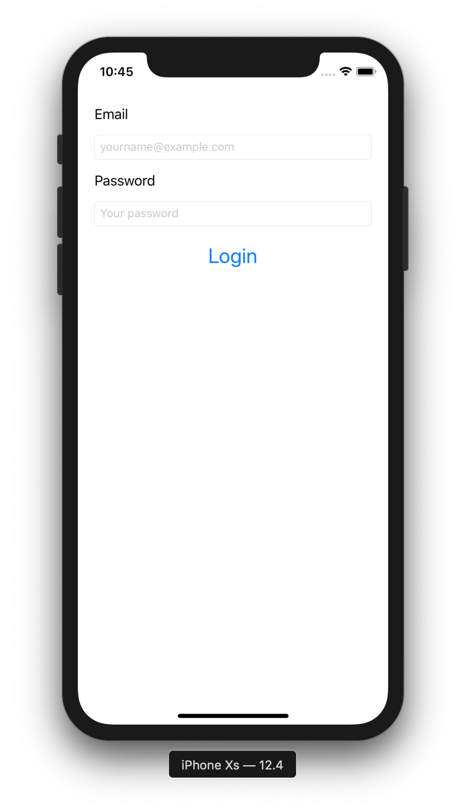

# Login Screen Exercise

In this exercise we'll create a simple login screen:



The main goal of this exercise is for you to get familiar with Auto Layout.

## Deadline

See the deadline on the [exercises page](./#fixed-exercises).

## Submission instructions

See the submission instructions on the [exercises page](./#submission-instructions).

## Instructions, Requirements and Hints

### Setting up the project

- Create a new App in Xcode, use the `Single View App` iOS Application template
- When creating the project, make sure `Include Unit Tests` is checked, but uncheck `Use Core Data` and `Include UI Tests`. We won't be using unit tests for this exercise, but we will be in future exercises that build upon this one.

### Building the layout

- Open the main storyboard file. Create a layout similar to the one in the screenshot above.
- Use `UILabel`, `UITextField` and `UIButton` to build the form
- Use auto layout constraints and/or `UIStackView` to ensure the layout works on all device sizes and orientations.
- There’s a crucial problem with this user interface. Any idea what that could be? (Hint: What happens when we tap one of the `UITextFields` while in landscape mode?) We won’t fix in this exercise yet, but it'll be tackled in a future exercise.
- Hook up all UI elements to appropriately named `@IBOutlet` variables in your code
- Hook up the login button to an `@IBAction` in your code

### Setting up the `UITextFields`

- The `UITextField` `Content Type` and `Keyboard Type` should be properly set to the content they contain (email/password). Enable secure text entry for the password field. To check if everything works, press CMD+K in the iOS Simulator to show the software keyboard.
- When pressing the return key, the appropriate action should happen. If the email textfield is currently selected, the password textfield should be selected afterwards. If the password textField is currently selected, the same action as pressing the login button should be called. Take a look at [`UITextFieldDelegate`](https://developer.apple.com/documentation/uikit/uitextfielddelegate) if you're not sure where to start.

### Implement the login action

- Use the Swift `guard` statement to implement client-side validation of login data. No need to verify the email address, for this exercise, it's enough to make sure that the text in the textfield is a non-empty string. If any of the textFields is empty, add some kind of indication that something is missing. For example, you could add another `UILabel` to the layout that has its `isHidden` property set to `true` and only appears after the verification fails. Or you could present a `UIAlertController` that contains an error message.
- For now, we won't actually be doing a real login to a webservice yet. Instead, simply check if the email and password match a hardcoded email/password combo.
- To simulate the asynchronous nature of the login, use the following code snippet:
```
DispatchQueue.main.asyncAfter(deadline: .now() + 2) {
    // This code executes after 2 seconds
    // Check here if the login was successful
}
```
- Present a `UIAlertController` when the fake login is done with a success or error message.
- We don't want the user to be able to log in twice at the same time. Make sure that while the fake login is running, all the UI elements are disabled (set `isEnabled` to `false`).
- While the fake login is running, the user should understand what's going on. Add feedback by creating a `UIActivityIndicatorView` in your storyboard. Make sure that it's initially hidden. Show it before calling the fake log in and hide it after it's done.
- Don't forget to clean up and re-enable the UI elements and hide the activity indicator once the login is done.

## Help and Support

As always, if you need any help or have any questions, feel free to [contact me](../README.md/#support-or-contact). I'm happy to help!
