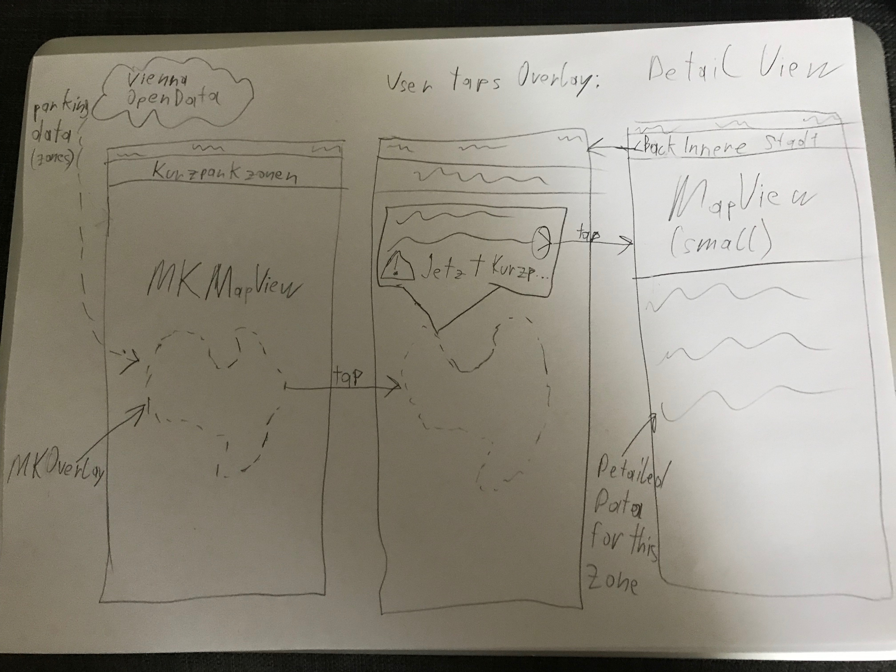

# Sample proposal

## Parking Zones Vienna

I will use [this API](https://www.data.gv.at/katalog/dataset/6858b208-62bc-424e-9d7b-c89b74d3d3e3) from Open Data Vienna to obtain data for the parking zones (Kurzparkzonen) in Vienna. I'll download the data using `URLSession` and save it to disk, so the app works offline too. Any time the app is online, it'll check the API for updated data. Since the amount of data isn't too large (a few megabytes), and to keep things simple, I won't be using a database, but instead just save the data in a file.

I'll then use [MKMapView](https://developer.apple.com/documentation/mapkit/mkmapview) to display a map of Vienna. I'll add an [MKOverlay](https://developer.apple.com/documentation/mapkit/mkoverlay) for each of the parking zones, in different colors, depending on the category of parking. When the user taps a parking zone, I'll show a popover with additional information about the zone. I'll check the current device time and compare it with the time period that the parking zone has. If there's currently a short parking duration, I'll show a warning to the user.

Tapping the popover will push a detail view on a `UINavigationController` stack. The detail ViewController will show a smaller, non-interactive version of the same map and zone. It will also contain a UITableView with detailed information on this specific parking zone.

### Wireframes

