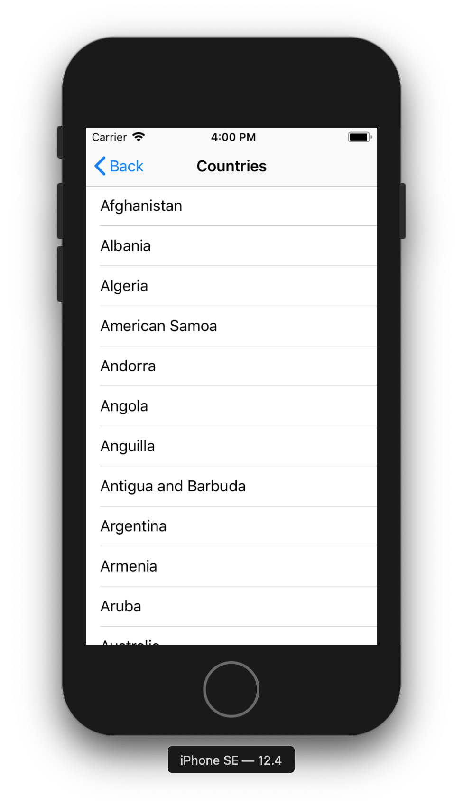

# TableView Exercise

In this exercise, you'll do a few things:

- Implement a `UIScrollView` to fix UI problems on the login screen
- Add navigation between viewControllers using a `UINavigationController`
- Download a list of countries in a JSON format that's difficult to parse
- Display the data in a `UITableView`
- Create a detailed viewController for the country data

The main goal of these tasks is to learn the following things:

- How to implement `UIScrollView` and make it play nice with Auto Layout constraints
- How to navigate between `UIViewControllers` and implement `UINavigationController`
- How to parse JSON data in more exotic formats
- How to implement a `UITableView`
- Strengthen your Auto Layout knowledge

## Deadline

See the deadline on the [exercises page](../#fixed-exercises).

## Submission instructions

See the submission instructions on the [exercises page](../#submission-instructions).

## API Key, Username, Password
 
In this exercise, we're going to use the REST API of the Google Firebase service. Specifically, we're going to use [this endpoint](https://firebase.google.com/docs/firestore/reference/rest/v1beta1/projects.databases.documents/list#http-request) to download a list of data. You shouldn't necessarily have to dig through the docs above to be able to complete this exercise. Everything you need should be in the instructions below, but the above link might still help you understand the inner workings of the API.

When using the API, build upon your code of the previous exercises and use the same credentials as in the [REST exercise](../rest-exercise).

## Instructions, Requirements and Hints

### Setting up the project

- Continue with the Xcode project from the previous exercise

### Fixing the big UI problem from the Login Exercise

Maybe you can remember: I mentioned in the Login Exercise that there's a critical UI problem in the current login screen. When we select one of the `UITextFields`, the keyboard might cover the UI elements (especially on smaller devices or when in landscape orientation). When this happens, there's no obvious way for the user to get out of this state or dismiss the keyboard - the only way to continue is to force quit the application! In that sense, this bug is even worse than a crash, so we definitely want to fix it.

To fix this, we want to embed all the UI elements in a `UIScrollView`. This way, we can scroll the content when the keyboard is visible and the screen space is too small to fit it all.

#### Adding the `UIScrollView`

- Add a `UIScrollView` to your layout. You can do so by dragging it into your viewController's view from the library and then dragging all your UI elements into it, or by selecting all the top-level UI elements you want to embed and selecting `Editor --> Embed In --> ScrollView` from the menu bar.
- Be aware that changing the superview of a `UIView` breaks all its constraints. We're going to have to set up new constraints to fix this.
- First, constrain the newly created scrollView to the edges of the safe area.
- Now constrain the UI elements to the edges of the scrollView. Leave a few pixels of margin so that the content isn't squished to the sides. You might have an easier time doing this if you're using a `UIStackView`, since there are much fewer constraints to create.
- If you run the app now, you will see that the content doesn't take up the full width of the screen. This is because by default, when constrained to a scrollView, the content takes up the minimum space possible as defined by its intrinsic content size.
- To fix this, we need to constrain the elements that are embedded in the scrollView to some reference outside of the scrollView. A good candidate for this is the Safe Area. Add an `Equal Width` constraint between the element(s) embedded in the scrollView. You can do so by `CTRL`-dragging (`CTRL`, not `CMD`) from the embedded element to the Safe Area in the object list in Interface Builder.
- Since you previously added a few pixels of horizontal margin, the UI elements will now be too large. If you ran your app now, you'd be able to scroll horizontally, since the scrollView's `contentSize` is larger than its `frame`. This isn't what we want. To fix this, modify the `Equal Width` constraint you just created and change its `constant` to a negative value to compensate for the margins you defined earlier. So for example, if you left `10` points of margin on either side of your textFields, you'd want to set the `constant` of your `Equal Width` constraint to `-20`.
- Getting `UIScrollView` to play nice with Auto Layout is a bit tricky and requires a bit of fiddling around, so if this doesn't work on your first try, don't get discouraged. You can also read through [this tutorial](https://medium.com/@pradeep_chauhan/how-to-configure-a-uiscrollview-with-auto-layout-in-interface-builder-218dcb4022d7) if you get stuck.
- If you run the app now, the content should look exactly like it did before we added the scrollView, both in landscape and in portrait. Hooray!
- However, our problem still isn't fixed. Try selecting one of the textFields to show the keyboard. The scrollView still doesn't scroll. This is because it actually doesn't know about the keyboard. To fix this, we're going to have to write some code.

#### Adjusting for keyboard changes

- To make things a bit easier for you, I've already implemented a class `KeyboardAdjustment` for you that handles these changes. You can find it [here](KeyboardAdjustment.swift). This class listens for a keyboard show/hide event and adjusts a scrollView's `contentInset` and `scrollIndicatorInsets` accordingly. All you need to do is to add the file to your project. Create an instance of the class in your `viewDidLoad` method and store it in a property in your ViewController. Pass your `scrollView` to the `KeyboardAdjustment` in the initializer. Now, the scrollView should scroll when the keyboard is visible.
- Feel free to take a closer look at the code in the `KeyboardAdjustment` class. Can you understand what it does?
- Our critical bug is now fixed, but unfortunately, we still can't dismiss the keyboard. A simple fix for this is to set the scrollView's `keyboardDismissMode` to `.interactive`. That way, when you scroll down quickly, the keyboard will dismiss. You can also do this in Interface Builder, if you prefer.

### Adding navigation

We want our login screen to actually lead somewhere. In this part of the exercise, you're going to create a new `UIViewController` and a `UINavigationController` to navigate between the `LoginViewController` and the newly created viewController.

- Start by dragging a `UINavigationController` into your storyboard. Interface builder will automatically create a `UITableViewController` as the navigationController's `rootViewController`. Since we don't want to use this tableViewController, select it and delete it.
- Set the application's entry point (the arrow in interface builder) to your newly created navigationController. Also, we have to set the navigationController's `rootViewController` to our `LoginViewController`. You can do so by selecting the navigationController, opening the Connections Inspector and click-dragging from `root view controller` to the `LoginViewController`.
- If you run the application now, you should see the login screen as expected. However, you can also see that the navigationController has added a `UINavigationBar` by default. Since it's just an empty bar and it's pretty useless in the login screen, we should hide it. You can do so by overriding the viewController's `viewWillAppear` method and calling `setNavigationBarHidden` on its `navigationController` property. Don't forget to call `super.viewWillAppear` first.
- Next, create an empty viewController by dragging it from the library into your storyboard. We want to navigate to this viewController on a successful login by pushing it onto the navigationController's stack.
- There's two approaches to implementing this form of navigation:
	- Create a manual segue and trigger it upon a successful login. You can do so by selecting the `LoginViewController`, opening the Connections Inspector and click-dragging from `manual` in the `Triggered Segues` section to the newly created viewController. You can then select the segue in the storyboard, open the Attributes Inspector and give the segue an identifier. In the `LoginViewController's` code, call `self.performSegue` upon a successful login to trigger the segue.
	- Alternatively, you can select the newly created `ViewController` and open the Identity Inspector. Enter a value in the ViewController's `Storyboard ID`. You can then reference this ViewController by its Storyboard ID. In the `LoginViewController's` code, you can call `self.storyboard?.instantiateViewController...` to manually instantiate the viewController. Then push the viewController onto the navigationController's stack.
- Great, we're now able to navigate to the new controller upon a successful login. However, there's no way to log out again. We've hidden the navigationBar, so we just have a blank screen. To fix this, let's create a new class for the viewController we just added. Let's call it `CountriesViewController`, because it will be displaying a list of countries in the future. Don't forget to set the custom class in interface builder. Then, we can override `viewWillAppear` to re-show the navigationBar.
- To make the navigationBar a little less empty, set the `CountriesViewController's` `title` property to `Countries`, for example in `viewDidLoad`.
- As you can see, the navigationBar will automatically display a working back button, which will make us return to the login screen. We now have a working navigation!

### Downloading the list of countries

Next, we want to download some data to display in our newly created viewController. In this part of the exercise, we're going to use the firebase API (specifically, [this endpoint](https://firebase.google.com/docs/firestore/reference/rest/v1beta1/projects.databases.documents/list#http-request
)) from the last exercise to download a list of countries.

- Add a new method to your networking class.
- In this method, create a `GET` request, similarly to how we did things in the REST exercise, to the following URL: `https://firestore.googleapis.com/v1/projects/mad-course-3ceb1/databases/(default)/documents/countries?pageSize=1000&orderBy=name`
- This time, the request body should be unset/empty. Also, we only need to set a single HTTP header, the `Authorization` header. Its value should be the String `"Bearer \(loggedInUser.idToken)"`, where `loggedInUser` is the user we authenticated in the login step. Without authentication, the API will return an error.
- To get to this `loggedInUser`, there are multiple approaches, each with its advantages and disadvantages. Feel free to pick one:
	- You could pass it in as a method parameter
	- You could store it in the networking class itself
- To test your new networking method, we need a good point to do so. A good point to download the countries data is `viewDidLoad` in `CountriesViewController`. However, we don't immediately have access to the networking class here. You could just create a new instance, but that would defeat the purpose of using a single `URLSession` for all our networking. Again, there are multiple approaches to solve this problem:
	- You could use the networking object you created in `LoginViewController` and pass it to `CountriesViewController`. You can do so upon creation of `CountriesViewController` or in `prepare(for segue: UIStoryboardSegue, sender: Any?)`, depending on how you implemented the transition between viewControllers. If you're unsure how to do this, check out [this guide](https://matteomanferdini.com/how-ios-view-controllers-communicate-with-each-other/).
	- You could make your networking class a singleton, so it can be accessed from anywhere in the application. While singletons are used a lot throughout iOS development, they're kind of an anti-pattern. [Here's a great article](https://matteomanferdini.com/swift-singleton/) explaining why singletons should be avoided. For the scope of this exercise it's ok to use one though.
- Call your new method in `viewDidLoad` of `CountriesViewController`. If everything's working, you should get a long list of countries in this format:

```
{
	"documents": [{
		"name": "projects/mad-course-3ceb1/databases/(default)/documents/countries/05GmkD91SrjOR2wyTn8u",
		"fields": {
			"name": {
				"stringValue": "Jamaica"
			},
			"languages": {
				"arrayValue": {
					"values": [{
						"stringValue": "en"
					}]
				}
			},
			"currency": {
				"stringValue": "JMD"
			},
			"capital": {
				"stringValue": "Kingston"
			},
			"native": {
				"stringValue": "Jamaica"
			},
			"continent": {
				"stringValue": "NA"
			},
			"phone": {
				"stringValue": "1876"
			}
		},
		"createTime": "2019-10-09T17:50:13.139043Z",
		"updateTime": "2019-10-09T17:50:13.139043Z"
	},
	...
	...
	...
	...
	...
	]
}
```

- Now we want to create our own `Country` model type. We want it to look like this:

```
struct Country: Decodable {
	var ID: String
	var name: String
	var currency: String
	var capital: String
	var native: String
	var continent: String
	var phone: String
	var createTime: Date
	var updateTime: Date
	var languages: [String]
}
```

- Take another look at the JSON format from above. Unfortunately, it has quite a strange format, making it a huge pain to parse into the type we defined above. To do so, here are some hints.
- First, create a root `struct` called `DocumentsContainer` that just has a `documents` property. This way we can extract the nested array:

```
    struct DocumentsContainer: Decodable {
        var documents: [Country]
    }
```

- You only need these two `Decodable` types (`Country` and `DocumentsContainer`) to parse this. The rest can all be done with custom `CodingKey` enums.
- We want to parse the `ID` from the last path component of the `name` property from the API. So for example, in the above response, `"name": "projects/mad-course-3ceb1/databases/(default)/documents/countries/05GmkD91SrjOR2wyTn8u"` the `ID` should be `05GmkD91SrjOR2wyTn8u`.
- To do this, we can create a `RootCodingKeys` enum:

```
	private enum RootCodingKeys: String, CodingKey {
		case ID = "name"
		case createTime
		case updateTime
		case fields
	}
```
- You can then use your `RootCodingKeys` enum by overriding the `init` method in `Country`:

```
        init(from decoder: Decoder) throws {
            let rootContainer = try decoder.container(keyedBy: RootCodingKeys.self)
            ID = (try rootContainer.decode(String.self, forKey: .ID) as NSString).lastPathComponent
            // decode other properties...
        }
```
- For testing purposes, it can be helpful to run the app and print out the (partially) parsed objects. To do so, you might want to temporarily give each of the properties in `Country` a default value. For example `var ID: String = ""`. Don't forget to remove it again when you're done.
- To decode `createTime` and `updateTime`, we need to set the `JSONDecoder's` `dateDecodingStrategy`. The date format that is returned in the JSON is in ISO 8601 format. Sounds like we can just use the `.iso8601` `DateDecodingStrategy`, but unfortunately, it doesn't work because the dates are not exactly in the correct format. So instead we have to create our own custom date formatter as described in [this article](https://useyourloaf.com/blog/swift-codable-with-custom-dates/). You can simply copy the `DateFormatter` extension from that link and use it as the `dateDecodingStrategy`.
- At this point you should be able to decode all the properties in the `rootContainer`, which are `ID`, `createTime` and `updateTime`.
- Now we have to parse all the nested properties as well. To do so, I already created the following `CodingKey` enums for you:

```
private enum NestedCodingKeys: String, CodingKey {
	case name
	case currency
	case capital
	case native
	case continent
	case phone
	case languages
}

private enum StringValueCodingKeys: String, CodingKey {
	case stringValue
}

private enum ArrayValueCodingKeys: String, CodingKey {
	case arrayValue
}

private enum ArrayValueNestedCodingKeys: String, CodingKey {
	case values
}
```
- In your overriden `init` method in `Country`, use a combination of `nestedContainer`, `nestedUnkeyedContainer` and `decode` to properly decode all the values. For example, to get to the container stored in the `fields` key, you can use:

```let nestedContainer = try rootContainer.nestedContainer(keyedBy: NestedCodingKeys.self, forKey:.fields)
```
- Once you're done, don't forget to clean up everything and implement error handling for the request, similar to the login request.
- For error handling, you might have to implement another `Decodable` error type, since the errors coming from this endpoint of the Firebase API have a different format than the ones in the login exercise. You can test it by sending a wrong or missing `IDToken` in the request.
- Your new networking method should return an array of countries or an optional error asynchronously in a closure, similar to the login method.

### Adding the tableView

In this part of the exercise, we're going to create a `UITableView` to display our countries.



- Now that we have our data, we also want to display it. Add a `UITableView` to the `CountryViewController` by dragging it into the view in Interface Builder. Note that we don't want to use `UITableViewController` for this exercise.
- Create a new outlet for your `tableView` and make `CountriesViewController` conform to the `UITableViewDelegate` and `UITableViewDataSource` protocols. Don't forget to connect everything in Interface Builder.
- Override the appropriate methods from `UITableViewDataSource` to display the countries. Make sure that you correctly re-use cells by adding a prototype cell with a Reuse Identifier in Interface Builder and calling `dequeueReusableCell` in your `cellForRowAt indexPath` implementation.
- Add a `countries: [Country]?` property in your `CountriesViewController`. You can set it when the request returns. Then, call `tableView.reloadData()` to reload the tableView data.
- Since the network request could take a while to return, we also want to show the user some visual feedback that something's happening, probably by showing a `UIActivityIndicatorView`. There's multiple approaches to do so:
	- You could add a view to the tableView's `tableHeaderView` or `tableFooterView`.
	- You could dynamically show/hide the tableView and activity indicator.

### Adding a detail view

In the last part of this exercise, we'll create a detailed viewController and view for each country. This viewController should display all the available information for each country.

- Add a `CountryDetailViewController`, which should be pushed onto the navigation stack whenever a cell is selected. There's two approaches to doing this:
	- Select your prototype cell in Interface Builder and open the Connections Inspector. Create a new Triggered Segue by click-dragging from `selection` to the `CountryDetailViewController`.
	- Override the `didSelectRowAt indexPath` in your `CountriesViewController's` implementation of `UITableViewDelegate`. Here you can then create the viewController manually and push it onto the navigation stack.
- You will have to pass the currently selected `Country` object on to the `CountryDetailViewController` once it is created. You can get the currently selected row by calling `tableView.indexPathForSelectedRow`. Depending on how you implemented the transition to `CountryDetailViewController`, you might have to override `prepare(for segue: UIStoryboardSegue, sender: Any?)` or assign it when creating the viewController in `didSelectRowAt indexPath`. Like mentioned in another section above, read [this guide](https://matteomanferdini.com/how-ios-view-controllers-communicate-with-each-other/) if you're having trouble passing data between viewControllers.
- Don't forget to deselect the cell again when coming back into the `CountriesViewController`. A good place to do this is `viewWillAppear`, by calling `tableView.deselectRow`. You can get the currently selected row by calling `tableView.indexPathForSelectedRow`.
- How you design your `CountryDetailViewController` is up to you. However, make sure that your layout is properly laid out with Auto Layout constraints and works in all interface orientations. Also, keep in mind that some countries have a lot of `languages`. How you solve this problem is also up to you, but make sure that there's support for an indefinite amount of languages. For example, you could add another `UITableView` to your `CountryDetailViewController` that doesn't cover the entire screen, but only a smaller area. Or you could embed the entire layout of the viewController in a `UIScrollView` and dynamically create `UILabels` for the languages.

## Help and Support

As always, if you need any help or have any questions, feel free to [contact me](../README.md/#support-or-contact). I'm happy to help!
